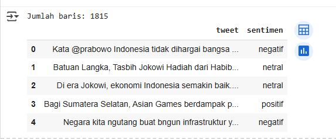
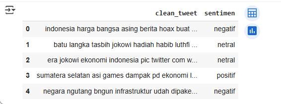
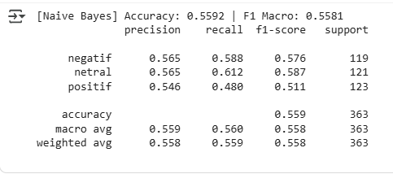
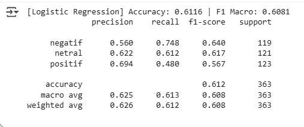
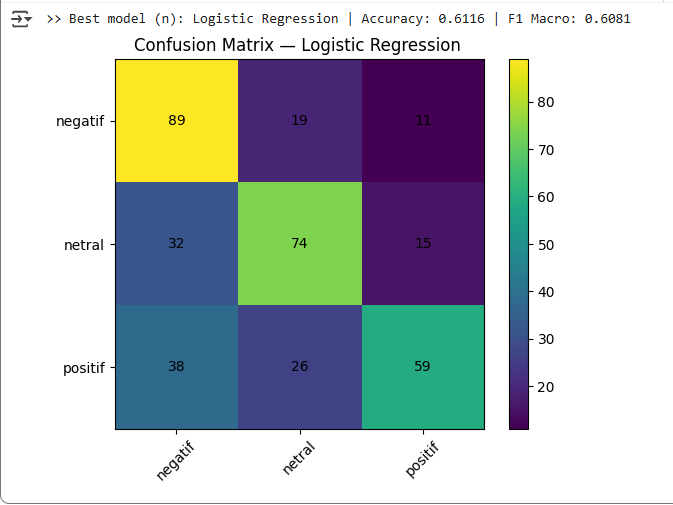

<<<<<<< HEAD
# Sentiment Analysis (Bahasa Indonesia)

Proyek ini melakukan **analisis sentimen tweet berbahasa Indonesia** menggunakan dua algoritma Machine Learning:  
- **Multinomial Naive Bayes**  
- **Logistic Regression**

---

## 📂 Dataset
- File: `data/tweet.csv`  
- Kolom utama:
  - `tweet` → teks tweet dalam bahasa Indonesia  
  - `sentimen` → label sentimen (positif, negatif, netral)  

---

## ⚙️ Pipeline
Notebook `notebooks/sentiment_id_no_tuning.ipynb` terdiri dari:  

1. Setup & Import Library  
2. Muat Data (`data/tweet.csv`)  
3. **Preprocessing Teks**  
   - Case folding (lowercase)  
   - Hapus URL (http/www/https)  
   - Hapus mention & hashtag  
   - Hapus karakter non-huruf (hanya huruf dan spasi)  
   - Tokenisasi  
   - Stopword removal (Sastrawi)  
   - Stemming (Sastrawi)  

   **Contoh Data Sebelum Preprocessing:**  
     

   **Contoh Data Sesudah Preprocessing:**  
     

4. TF-IDF Vectorization  
5. **Training & Evaluasi Model**  
   - Naive Bayes (MultinomialNB)  
       
   - Logistic Regression  
       
6. **Evaluasi Lanjutan & Visualisasi**  
   - Akurasi & F1-score  
     
   - **Best Model Result (Logistic Regression):**
     
     

---

## 📊 Visualisasi

  

### Distribusi Label
Tambahkan visualisasi distribusi sentimen:  

```python
import matplotlib.pyplot as plt

df['sentimen'].value_counts().plot(kind='bar', color=['green','red','gray'])
plt.title("Distribusi Sentimen")
plt.xlabel("Kategori")
plt.ylabel("Jumlah")
plt.savefig("results/sentiment_distribution.png")
plt.show()
```

Hasil grafik bisa diekspor sebagai `results/sentiment_distribution.png` dan ditampilkan di README:  

  

---

## 🚀 Cara Menjalankan
1. Clone repo:
   ```bash
   git clone https://github.com/USERNAME/sentiment-analysis-id.git
   cd sentiment-analysis-id
   ```
2. Jalankan notebook `notebooks/sentiment_id_no_tuning.ipynb` di Jupyter/Colab.  
3. Pastikan file dataset `data/tweet.csv` berada di folder `data/`.  

---

## 📌 Catatan
- Belum ada hyperparameter tuning.  
- Bisa ditingkatkan dengan **GridSearchCV**, **SVM**, atau **Transformer models (IndoBERT)**.  

---

>>>>>>> f6cf1fe8ac9eba15c5e3af39115d788f3f6dda82
